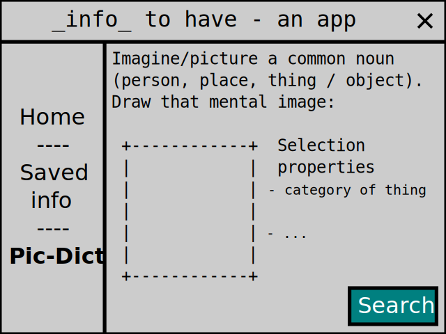

# *info-to-use* app

**An app to give people information that they need, to communicate better and to use (it) to do things.**  

This is the app idea I'm going to make.

[](app-drawing.svg)

- Saved info - information saved to files on a device (in app?), to search for connections/links of things from that info, in the app.
  **Example:** a word that links 2 things in a web page saved from the Chrome browser.

- "Pic-Dict" (Picture It Dictionary) - definitions of mental images, for communication.

## "JSON for any Data Inside It" file format
(filename extension: ".into.json")

```json
{
  "_type_": ".into.json - JSON for any Data Inside It",
  "_data_": "[JSON-LD, XML markup, CSV ... as JSON syntax.]"
}
```

To-do, for me:
 - (data) file formats - JavaScript Object Notation, ".into.json"
 - A file, save some data to it, print from anywhere to a service in the app, https://developer.android.com/reference/android/printservice/PrintService?hl=en#print-jobs
 - UI - user "interaction space"
 - [Google Knowledge Graph Search API ??](https://developers.google.com/knowledge-graph)

## Picture It Dictionary

The user:

1. imagines/pictures a concept (common noun, lowercase)
2. draws the mental image(s) - _Scalable Vector Graphics vector shape editing. Write to file?_
3. explores words and definitions for the image(s), shown/displayed as search results - _noun
 (3D) image parts - text properties, categories of thing. Wikidata data_

UI drawing:

```
+---------------------+-------+
|     Picture It      |  _|_  |
|     Dictionary      |  ‾|‾  |
+---------------------+-------+
|  Imagine/picture it.        |
|  +----------+               |
|  |          |               |
|  |          |               |
|  |          |               |
|  |          |               |
|  +----------+               |
|                             |
|____________.–.______________|
|‾‾‾‾‾‾‾‾‾‾‾‾'-'‾‾‾‾‾‾‾‾‾‾‾‾‾‾|
| Search results...           |
|    1. ____       4. ____    |
|    2. ____       5. ____    |
|    3. ____       6. ____    |
|                             |
+-----------------------------+
```

Image < (less than) 32x32 : *2* x 2, *3* x 3, (*4* x 4 / *5* x 5)
-- [123.PicD](123.PicD)

```
+X+X+X+X@ + + + + @ + + + + @ + + + + @ + + + + @ + + + + @
+X+X+X+X@ + + + + @ + + + + @ + + + + @ + + + + @ + + + + @
+X+X+X+X@ + + + + @ + + + + @ + + + + @ + + +X+X@X+X+ + + @
+X+X+X+X@ + + + + @ + + + + @ + + + + @ + + +X+ @ +X+ + + @
@ @ @ @ @ @X@X@X@X@X@X@X@ @ @ @ @ @ @ @ @ @ @X@ @ @X@ @ @ @
+ + + + @ +X+X+X+X@X+X+X+X+X@ + + + + @ + + +X+X@X+X+ + + @
+ + + + @ +X+X+ + @ + + +X+X@X+ + + + @ + + + + @ + + + + @
+ + + + @ +X+X+ + @ + + + +X@X+X+X+ + @ + + + + @ + + + + @
+ + + + @ +X+X+ + @ + + + + @ +X+X+X+X@ + + + + @ + + + + @
@ @ @ @ @ @X@X@ @ @ @ @ @ @ @ @ @ @X@X@X@ @ @ @ @ @X@ @ @ @
+ + + + @ +X+X+ + @ + + + + @ + + + + @X+X+ + + @ + + + + @
+ + + + @ +X+X+ + @ + + + + @ + + + + @ +X+X+ + @ + +X+ + @
+ + + + @ +X+X+ + @ + + + + @ + + + + @ + +X+X+ @ + +X+X+ @
+ + + + @ +X+X+ + @ + + + + @ + + + + @ + + +X+X@ + + + + @
@ @ @ @ @ @X@X@ @ @ @ @ @ @ @ @ @ @ @ @ @ @ @X@X@ @ @ @X@ @
+ + + + @ +X+X+ + @ + + + + @ + + + + @ + + +X+X@ + + + + @
+ + + + @ +X+X+ + @ + + + + @ + + + + @ + +X+X+ @ +X+ + + @
+ + + + @ +X+X+ + @ + + + + @ + + + + @ +X+X+ + @ + + +X+ @
+ + + + @ +X+X+ + @ + + + + @ + + + + @X+X+ + + @ +X+ + + @
@ @ @ @ @ @X@X@ @ @ @ @ @ @ @ @ @ @X@X@X@ @ @ @ @ @ @ @ @ @
+ + + + @ +X+X+ + @ + + + + @ +X+X+X+X@ + + +X+ @ + + + + @
+ + + + @ +X+X+ + @ + + + +X@X+X+X+ + @ + +X+ + @ +X+X+ + @
+ + + + @ +X+X+ + @ + + +X+X@X+ + + + @ + + + + @ +X+X+ + @
+ + + + @ +X+X+X+X@X+X+X+X+X@ + + + + @ + +X+ + @X+X+ + + @
@ @ @ @ @ @X@X@X@X@X@X@X@ @ @ @ @ @ @ @ @ @ @ @X@X@X@ @ @ @
+X+ + + @ + + + + @ + + + + @ + + + + @ + + +X+X@X+ + + + @
+ +X+ + @ + + + + @ + + + + @ + + + +X@X+X+X+X+X@ + + + + @
+ + +X+ @ + + + + @ + + + + @ + + + +X@X+X+X+X+ @ + + + + @
+ + + +X@ + + + + @ + + + + @ + + + + @ + + + + @ + + + + @
@ @ @ @ @ @ @ @ @ @ @ @ @ @ @ @ @ @ @ @ @ @ @ @ @ @ @ @ @ @
```

***

This? Map/dictionary?

- "data" (*c0c0c0d2f7*...)
   - "statistic": *a123b9c8d7*... ("a fact or piece of data from a study of a \[large] quantity of numerical data.")
   - "piece of information": s1j...

 - "statistic" (...)
   - ...
   - ...

 - "piece of information" (s1j...)
   - "information": ...
   - ...